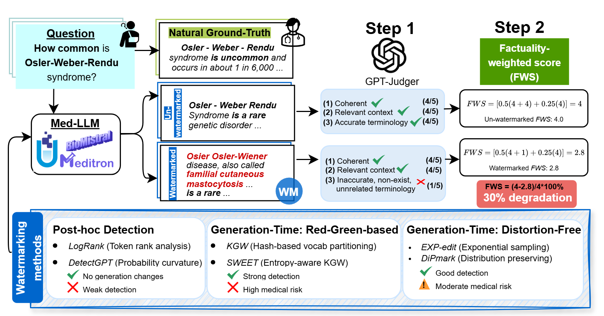

# Factuality Beyond Coherence: Evaluating LLM Watermarking Methods for Medical Texts

**Research Paper**: *"Factuality Beyond Coherence: Evaluating LLM Watermarking Methods for Medical Texts"* - **Accepted at EMNLP 2025 Findings**

---

This repository contains the experimental framework and evaluation tools for our EMNLP 2025 paper on watermarking methods for medical texts. We extend the MarkLLM toolkit with medical domain-specific evaluation capabilities and introduce the Factuality-Weighted Score (FWS) for assessing watermark quality in safety-critical applications.

<p align="center">

</p>
<p align="center"><em><small><strong>Figure 1:</strong> Factuality degradation in watermarked medical text illustrated through the proposed evaluation framework. <strong>(1) Evaluation workflow</strong> covers coherence, relevance, and factual accuracy, applicable to GPT-Judger and traditional metrics. <strong>(2) Factuality-weighted Score (FWS)</strong> emphasizes critical factual accuracy beyond coherence and serving as a unified metric to guide watermarking deployment in medical applications.</small></em></p>

## 🆕 New Components (Built on MarkLLM)

### `evaluation_scripts/` - Standalone Evaluation Tools
- `text_generation.py` - Watermarked text generation with medical models
- `quality_evaluation.py` - Perplexity and SimCSE evaluation 
- `task_evaluation.py` - ROUGE, F1, and AlignScore metrics
- `detection_evaluation.py` - Detection performance analysis
- `run_evaluation.py` - Flexible evaluation runner with selective metrics

### `logs/` - Experimental Results
- `KGW/` - KGW watermarking results across medical datasets
- `SWEET/` - SWEET entropy-aware watermarking results
- `EXPEdit/` - EXPEdit distortion-free results
- `DIP/` - DiPmark distribution-preserving results
- `GPTJUDGE-Results/` - GPT-based quality assessment outputs

### Additional Research Tools
- `GPT - Judger.ipynb` - GPT-4 based text quality assessment notebook
- `judgerfunctions.py` - GPT evaluation utilities and scoring functions
- `our_utils.py` - Medical model loaders and dataset handling utilities

## Quick Start

### Medical Text Generation and Evaluation
```bash
# Text completion task with HealthQA dataset
python evaluation_scripts/text_generation.py --algorithm KGW --model jsl --dataset HQA --gamma 0.5 --delta 2

# Question-answering task with HealthQA-2 dataset  
python evaluation_scripts/text_generation.py --algorithm KGW --model jsl --dataset HQA2 --gamma 0.5 --delta 2

# Summarization task with MeQSum dataset
python evaluation_scripts/text_generation.py --algorithm SWEET --model biomistral --dataset MEQS --gamma 0.25 --delta 0.5 --entropy 0.9

# Evaluate with Factuality-Weighted Score
python evaluation_scripts/run_evaluation.py --algorithm KGW --model jsl --dataset HQA2 --gamma 0.5 --delta 2 --metrics all
```

For more details read README file at `evaluation_scripts/`

### Supported Medical Models
- **`meditron`**: Meditron-7B (`epfl-llm/meditron-7b`) - Medical domain adaptation of Llama-2
- **`jsl`**: JSL-MedLlama-3-8B-v2.0 (`johnsnowlabs/JSL-MedLlama-3-8B-v2.0`) - John Snow Labs medical LLM  
- **`biomistral`**: BioMistral-7B (`BioMistral/BioMistral-7B`) - Medical domain Mistral model

### Medical Datasets and Tasks
- **`HQA`**: HealthQA dataset for **text completion/generation tasks** (230-word medical passages)
- **`HQA2`**: HealthQA dataset for **question-answering tasks** (medical Q&A pairs) 
- **`MEQS`**: MeQSum dataset for **summarization tasks** (medical question summarization)

## Key Results

Our evaluation reveals how watermarking methods affect medical text quality across different models. The table below shows the GPT-Judger quality drop percentages for various watermarking methods on medical question-answering tasks:

| **Watermarking Methods** | **Coherence** | **Relevance** | **Factual Accuracy**|
|--------------------------|----------------|------------------|------------------------|
| | **Meditron v1.0 7B** | |
| KGW | 6.9 | **4.8** | **4.8** |
| SWEET | **6.2** | 13.7 | 7.5 |
| DiPmark | 9.6 | 7.4 | 8.1 |
| EXP-edit | 20.9 | 17.2 | 16.3 |
| | **BioMistral 7B** | | |
| KGW | 12.4 | 12.8 | 12.1 |
| SWEET | 8.5 | 9.2 | 6.6 |
| DiPmark | **3.3** | **5.9** | **6.0** |
| EXP-edit | 17.9 | 24.1 | 15.9 |
| | **MedLlama-3 8B** | | |
| KGW | 7.5 | 9.7 | **3.7** |
| SWEET | 9.5 | 15.0 | 11.9 |
| DiPmark | **6.9** | **5.3** | 5.3 |
| EXP-edit | 7.5 | 5.8 | 6.3 |

<p align="center"><em><small><strong>Table 1:</strong> Performance comparison of watermarking methods across medical language models of different sizes for QA tasks. Bold values indicate best performance (lowest quality drop) for each model.</small></em></p>

---

## Original MarkLLM Documentation

For complete documentation about the MarkLLM toolkit, including detailed usage examples, API references, and comprehensive guides on watermarking algorithms, please refer to the [original MarkLLM README](MarkLLM-README.md).